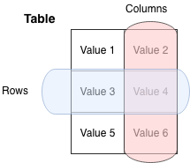
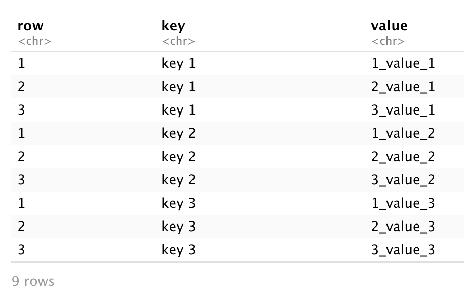
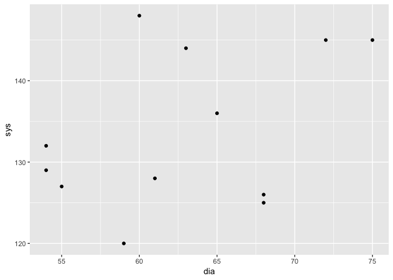
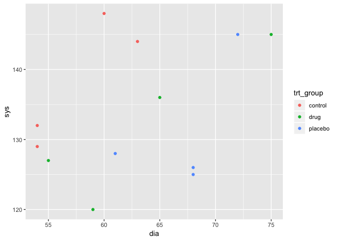
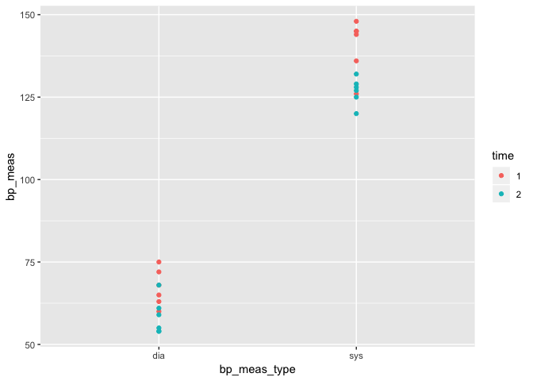
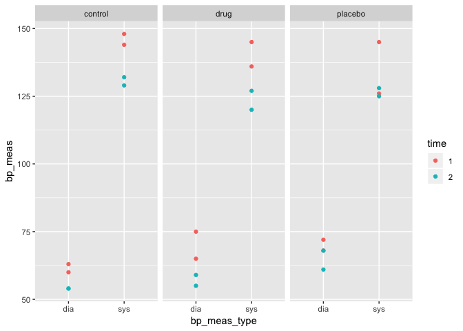

Getting Started with tidyverse
================
Martin Frigaard
2017-05-12

# Getting started with tidyverse

The [`tidyverse`](http://tidyverse.org/) is a collection of R packages
developed primarily by RStudio’s chief scientist [Hadley
Wickham](http://hadley.nz/). These packages play well together by
adhering to some underlying principles, one of which we will explore
below. To learn more about these tools and how they work together, read
[R for data science](https://r4ds.had.co.nz/). For newcomers to R,
please check out my previous tutorial for Storybench: [Getting Started
with R in RStudio
Notebooks](http://www.storybench.org/getting-started-r-rstudio-notebooks/).

The following tutorial will introduce three underlying concepts about
working with data in the `tidyverse`. These ideas are tidy data, tabular
data, and the pipe. Understanding these principles will make it easier
to work with the other packages in the `tidyverse` to manipulate and
re-structure your data for visualizations and modeling. Read more about
the tidy principles in the [Tidy Tools
Manifesto](https://cran.r-project.org/web/packages/tidyverse/vignettes/manifesto.html).

## Load the packages

Install and load the `tidyverse` and `magrittr` packages for this
tutorial.

``` r
install.packages(c("tidyverse", "magrittr"))
library(tidyverse)
library(magrittr)
```

## What is tidy data?

“Tidy data” is a term that describes a standardized approach to
structuring datasets to make analyses and visualizations easier in R. If
you’ve worked with SQL and relational databases, you’ll recognize most
of these concepts. Hadley Wickham distilled a lot of the technical
jargon from [Edgar F. Codd’s normal
form](https://en.wikipedia.org/wiki/Third_normal_form) and applied it to
statistical terms. More importantly, he translated the important
principles into terms just about anyone doing data analysis should be
able to recognize and understand.

### The core tidy data principles

There are three principles for tidy data:

1.  Variables make up columns
2.  Observations (or cases) go in the rows
3.  Values are in cells

*The third principle is almost a given if you’ve handled the first two,
so we will focus on these.*

R has quite a few objects for storing data–more than we can cover in a
single post. But the beauty of working in the `tidyverse` is that you
can focus on just a few of these objects (and start
analyzing/visualizing data quickly). You’ve learned about atomic vectors
in the [first
tutorial](http://www.storybench.org/getting-started-r-rstudio-notebooks/).
The next two objects we will introduce are `tibble`s and `data.frame`s.

## Storing data in tables

The three principles outlined above provide a foundation for thinking
about your data. The shape these principles create is a square or
rectangle.

See below:

<!-- -->

At the intersection of each column and row is a value. In order to know
which values we are referring to, we’ll need a way to think about their
location in the table. The table below shows an address for each of the
values in the table above.

|                  | column 1 = `[ , 1]` | column 2 = `[ , 2]` |
| ---------------- | ------------------- | ------------------- |
| row 1 = `[ 1, ]` | `[row 1, col 1]`    | `[row 1, col 2]`    |
| row 2 = `[ 2, ]` | `[row 2, col 1]`    | `[row 2, col 2]`    |
| row 3 = `[ 3, ]` | `[row 3, col 1]`    | `[row 3, col 2]`    |

The brackets `[ ]` give me access to each value’s position. If I want to
look at the value in column 1, row 3 I would use `data[ 3, 1]`. This
gives me the ability to refer to individual values using their row and
column position. We will put this operator to use below.

### Data frames

The code below will create a `base::data.frame`. This function needs the
`stringsAsFactors` argument set to `FALSE`, the names of the columns
(`column 1` and `column 1`), the names of the rows (as `row.names =
c("row 1", "row 2", "row 3")`), and the values in each cell.

*Don’t worry about what all of these arguments do–we will cover that
later. Just focus on the resulting object*

``` r
DataFrame <- base::data.frame(stringsAsFactors = FALSE, 
            `column 1` = c("row 1, col 1", "row 2, col 1", "row 3, col 1"),
            `column 2` = c("row 1, col 2", "row 2, col 2", "row 3, col 2"),
            row.names = c("row 1", "row 2", "row 3"))
DataFrame
```

    ##           column.1     column.2
    ## row 1 row 1, col 1 row 1, col 2
    ## row 2 row 2, col 1 row 2, col 2
    ## row 3 row 3, col 1 row 3, col 2

**Things to know about `data.frame`s:**

1.  They have row names

<!-- end list -->

``` r
# check row.names
base::row.names(DataFrame)
```

    ## [1] "row 1" "row 2" "row 3"

2.  The columns in `data.frame`s are vectors.

<!-- end list -->

``` r
# subset the first column 
base::is.vector(DataFrame[ , 1])
```

    ## [1] TRUE

3.  The rows in `data.frame`s are lists

<!-- end list -->

``` r
# subset the first row
base::is.list(DataFrame[ 1, ])
```

    ## [1] TRUE

4.  Column names can’t be non-syntactic (i.e. have white space, start
    with a number, etc)

<!-- end list -->

``` r
# the base::data.frame() function added a period 
 base::names(DataFrame)
```

    ## [1] "column.1" "column.2"

### Tibbles

A `tibble` is an optimized way to store and display data when using
packages from the `tidyverse`. We can create a `tibble` similar to the
`data.frame` above with the `tibble::tribble()` function. Unlike the
`base::data.frame()` function, we can arrange these data just like would
appear in the `tibble`. The `~` operator is used to signify the column
names, and the values are entered below each column (separated by
commas).

``` r
Tibble <- tibble::tribble(
    ~`column 1`, ~`column 2`,
    "row 1, col 1", "row 1, col 2",
    "row 2, col 1", "row 2, col 2")
Tibble
```

    ## # A tibble: 2 x 2
    ##   `column 1`   `column 2`  
    ##   <chr>        <chr>       
    ## 1 row 1, col 1 row 1, col 2
    ## 2 row 2, col 1 row 2, col 2

**Things to know about `tibble`s:**

1.  There is no need to tell R what to do with `strings` (i.e. no
    `stringsAsFactors` argument)

<!-- end list -->

``` r
?tribble
```

2.  `tibble`s don’t need row names

<!-- end list -->

``` r
base::row.names(Tibble)
```

    ## [1] "1" "2"

3.  `tibble`s offer more flexibility in column names (they allow
    non-syntactic names).

<!-- end list -->

``` r
base::names(Tibble)
```

    ## [1] "column 1" "column 2"

Other than these differences, these two objects are very similar. In
fact, a `tibble` is a `data.frame` (but a `data.frame` is not a
`tibble`)

We can check this with `utils::str()`

``` r
utils::str(DataFrame)
```

    ## 'data.frame':    3 obs. of  2 variables:
    ##  $ column.1: chr  "row 1, col 1" "row 2, col 1" "row 3, col 1"
    ##  $ column.2: chr  "row 1, col 2" "row 2, col 2" "row 3, col 2"

``` r
utils::str(Tibble)
```

    ## Classes 'tbl_df', 'tbl' and 'data.frame':    2 obs. of  2 variables:
    ##  $ column 1: chr  "row 1, col 1" "row 2, col 1"
    ##  $ column 2: chr  "row 1, col 2" "row 2, col 2"

You can read more about them [here](http://tibble.tidyverse.org/).

## The “pipe”

The pipe is a symbol (`%>%`) from the `magrittr` package. It makes the R
language easier to write and understand. If you imagine the objects in R
(data frames, vectors, etc.) are nouns, the functions (`function()`)
like verbs. Functions do things to objects. If I wanted to apply
function `f()` to object `x`, I would write it as `f(x)`. If I had a
series of functions to apply to `x`, they would be written `h(g(f(x)))`.

This gets hard to read when there are multiple functions to apply,
because if I start reading from left to right, the first function I
read, `h()`, is the last function that gets applied to `x`. Fortunately,
the pipe allows us to write R code like so:

`x %>% f() %>% g() %>% h()`

Isn’t that better? Read about using it
[here.](https://cran.r-project.org/web/packages/magrittr/vignettes/magrittr.html)

## What is a variable?

A **variable** is any measurement that can take multiple values.
Depending on the field a dataset comes from, variables can be referred
to as an independent or dependent variables, features, predictors,
outcomes, targets, responses, or attributes.

Variables can generally fit into three categories:

  - **fixed variables** (characteristics that were known before the data
    were collected),  
  - **measured variables** (variables containing information captured
    during a study or investigation), and  
  - **derived variables** (variables that are created during the
    analysis process from existing variables)

Here’s an example: Suppose clinicians were testing a new
anti-hypertensive drug. They recruit 30 patients, all of whom are being
treated for high blood pressure, and divide them randomly into three
groups. The clinician gives one third of the patients the drug for eight
weeks, another third gets a placebo, and the final third gets care as
usual. At the beginning of the study, the clinicians collect information
about the patients. These measurements included the patient’s sex, age,
weight, height, and baseline blood pressure (pre BP).

For patients in this hypothetical study, suppose the group they were
randomized to (i.e the drug, control, or placebo group), would be
considered a fixed variable. The measured `pre BP` (and `post BP`) would
be considered the measured variables.

Suppose that after the trial was over, all of the data were collected,
and the clinicians wanted a way of identifying the number of patients in
the trial with a reduced blood pressure (yes or no)? One way is to
create a new categorical variable that would identify the patients with
post BP less than 140 mm Hg (`1` = `yes`, `0` = `no`). This new
categorical variable would be considered a derived variable.

The data for the fictional study I’ve described also contains an
underlying dimension of time. As the description implies, each patient’s
blood pressure was measured before and after they took the drug (or
placebo). So these data could conceivably have variables for date of
enrollment (the date a patient entered the study), date of pre blood
pressure measurement (baseline measurements), date of drug delivery
(patient takes the drug), date of post blood pressure measurement (blood
pressure measurement taken at the end of the study).

## What’s an observation?

Observations are the unit of analysis or whatever the “thing” is that’s
being described by the variables. Sticking with our hypothetical blood
pressure trial, the patients would be the unit of analysis. In a tidy
dataset, we would expect each row to represent a single patient.
Observations are a bit like [nouns](https://en.wikipedia.org/wiki/Noun),
in a sense that pinning down an exact definition can be difficult, and
it often relies heavily on how the data were collected and what kind of
questions you’re trying to answer. Other terms for observations include
records, cases, examples, instance, or samples.

### Different table, same data

Imagine a single number, 140, sitting in a table.

|       | Column 1 | Column 2 |
| ----- | -------- | -------- |
| row 1 | 140      |          |
| row 2 |          |          |

We could say this number’s location is the intersection of Column 1 and
Row 1, but that doesn’t tell us much about the number. The data, 140, is
meaningless if it’s just sitting in a cell without any information about
what it represents. A number all alone in a table begs the question,
“*one hundred and forty what?*”

This is why thinking of a table as being made of variables (in the
columns) and observations (in the rows) helps get to the meaning behind
the values in each cell. After adding variable (column) and observation
(row) names, we can answer the question above by saying, “*these data
are `[insert variable]` on `[insert observation]`*”

For example, by adding two variable names and one additional observation
I can see that this `140` is the pre diastolic blood pressure
(`pre_dia_bp`) for patient number 3 (`patient_3`).

| `id`        | `pre_dia_bp` | Column 2 |
| ----------- | ------------ | -------- |
| `patient_3` | 140          |          |
| row 2       |              |          |

As time goes on in this hypothetical study, a second measurement gets
taken on patient 3 and placed in the next column. This might look like
the table below.

| `id`        | `pre_dia_bp` | `post_dia_bp` |
| ----------- | ------------ | ------------- |
| `patient_3` | 140          | 120           |
| row 2       |              |               |

This is a logical way to enter data into a spreadsheet or database. As
new measurements are taken, the user creates a new column and enters the
new values into the corresponding row. This is because it’s relatively
easy to track this information visually. We can look at `patient_3`,
then track their information from right to left.

However, these data could also be structured in the following
arrangement.

| `patient_id` | `dia_meas` | `dia_value` |
| ------------ | ---------- | ----------- |
| 03           | pre        | 140         |
| 03           | post       | 120         |

This arrangement is displaying the same information (i.e. the pre and
post diastolic blood pressures for patient number 3), but now the column
`dia_meas` contains information on blood pressure measurement type
(`pre` or `post`), and the `dia_value` has the numerical value.

This is tidy data. There is only one variable per column and one
observation per row. We’ll build another pet example to further
establish some basic tidying terminology.

### Key value pairs

The code below will create a key-value pair reference `tibble`. We are
going to build a `tibble` from scratch, defining the variables,
observations, and contents of each cell. By doing this, we’ll be able to
keep track of what happens as we rearrange these data. The goal of this
brief exercise is to make key-value pairs easier to see and understand.

``` r
KeyValue <- tibble::tribble(
     ~`row`, ~`key 1`, ~`key 2`, ~`key 3`, # names of the columns indicated with
     "1", "1_value_1","1_value_2","1_value_3", # Row 1
     "2", "2_value_1", "2_value_2", "2_value_3", # Row 2
     "3", "3_value_1", "3_value_2", "3_value_3") # Row 3
KeyValue
```

    ## # A tibble: 3 x 4
    ##   row   `key 1`   `key 2`   `key 3`  
    ##   <chr> <chr>     <chr>     <chr>    
    ## 1 1     1_value_1 1_value_2 1_value_3
    ## 2 2     2_value_1 2_value_2 2_value_3
    ## 3 3     3_value_1 3_value_2 3_value_3

Our new object (`KeyValue`) is built with the following underlying
logic:

  - Rows are numbered with a number (1–3) and an underscore (\_), and
    always appear at the front of a value  
  - Columns are numbered with an underscore (\_) and a number (1–3), and
    always appear at the end of a value

## Using the tidyr package

`tidyr` is a package from the tidyverse that helps you structure (or
re-structure) your data so its easier to visualize and model. Here is a
[link to the tidyr page](http://tidyr.tidyverse.org/). Tidying a data
set usually involves some combination of either converting rows to
columns (spreading), or switching the columns to rows (gathering).

We can use our `KeyValue` object to explore how these functions work.

### Gathering data

This is how `tidyr` defines `gather`:

> “Gather takes multiple columns and collapses into key-value pairs,
> duplicating all other columns as needed. You use `gather()` when you
> notice that you have columns that are not variables.”

Let’s start by gathering the three key columns into a single column,
with a new column value that will contain all their values. Use
`KeyValue` as the initial object and pipe it to the `tidyr::gather()`
function. Store this in a new object called `KeyValueGathered`.

``` r
KeyValueGathered <- KeyValue %>% 
     tidyr::gather(key = key, # new column for the 3 key columns
            value = value, # contains the 9 distinct values
            `key 1`:`key 3`, # range of columns we want gathered
            na.rm = TRUE # handles missing
            )
KeyValueGathered
```

<!-- -->

Notice the new structure:

  - The new `key` column is now 9 rows, with the values from the three
    former `key 1`, `key 2`, and `key 3` columns.

  - The `value` column contains all the content from the cells at each
    intersection of row and the `key 1`, `key 2`, and `key 3` columns

We’ve used `tidyr::gather()` to scoop up the data that was originally
scattered across three columns and placed them into two columns: `key`
and `value`.

### What happened?

Key-value pairs pair up keys with values. This means when we specified
`key` as the name of the new column, the command took the three previous
key columns and stacked them inside this variable. Then we specified
`value` as the name of the new column with their corresponding value
pair.

What about the row column? We left this column out of the call because
we want it to stay in the same arrangement (i.e. 1,2,3). When the `key`
and `value` columns get stacked, these rows get repeated down the
column,

Nothing was lost in the process, either. I can still look at the
intersection of row 3 and key 2 and see the resulting value `3_value_2`.

``` r
KeyValueGathered[ 6, 3]
```

    ## # A tibble: 1 x 1
    ##   value    
    ##   <chr>    
    ## 1 3_value_2

### Spreading data

Now we’ll `spread` the `key` and `value` columns back into their
original arrangement (three columns of `key 1`, `key 2`, & `key 3`). The
`spread` description [reads](http://tidyr.tidyverse.org/):

> “Spread a key-value pair across multiple columns.”

Store this new arrangement in a new object called `KeyValueSpreaded`.

``` r
KeyValueSpreaded <- KeyValueGathered %>% 
     tidyr::spread(key = key, 
                   value = value)
KeyValueSpreaded
```

<!-- -->

Spread moved the values that were stacked in two columns (`key` and
`value`) into the three distinct `key` columns.

The key-value pairs are the indexes we can use to rearrange the data to
make it tidy.

### Which version of the table is tidy?

We stated that tidy data means, “one variable per column, one
observation per row,” so the arrangement that satisfied this condition
is the `KeyValueGathered` data set.

But I want to stress that without some underlying knowledge of what
these variables and observations actually contain, it’s hard to know
which arrangement of any data set is tidy.

## Why tidy data?

Tidy data is the preferred data storage format in R because of how the R
functions work. Each column in a `tibble` is a vector, so by tidying our
data, we give R’s access to each of our variables.

See this section from [Efficient R
Programming](https://bookdown.org/csgillespie/efficientR/programming.html#top-5-tips-for-efficient-programming)
by Colin Gillespie and Robin Lovelace for a better explanation,

> Recall the golden rule in R programming, **access the underlying
> C/Fortran routines as quickly as possible**; the fewer functions calls
> required to achieve this, the better. With this mind, many R functions
> are vectorised, that is the function’s inputs and/or outputs naturally
> work with vectors, reducing the number of function calls required.

If a variable is spread across multiple variables (i.e. multiple
vectors), the functions can’t do their job.

## Demonstrating tidiness

The data below are similar to the example trial we introduced above,
only I’ve added two other measurements: 1) the systolic blood pressure
(`sys`), and 2) the group each patient was assigned to (`trt_group`).

These data are stored in the `BpData` `tibble`.

``` r
BpData <- tibble::tribble(~pat_id,   ~time, ~dia, ~sys, ~trt_group,
                                     1, "1",   63,  144,  "control",
                                     1, "2",   54,  132,  "control",
                                     2, "1",   60,  148,  "control",
                                     2, "2",   54,  129,  "control",
                                     3, "1",   72,  145,  "placebo",
                                     3, "2",   61,  128,  "placebo",
                                     4, "1",   68,  126,  "placebo",
                                     4, "2",   68,  125,  "placebo",
                                     5, "1",   75,  145,     "drug",
                                     5, "2",   55,  127,     "drug",
                                     6, "1",   65,  136,     "drug",
                                     6, "2",   59,  120,     "drug")
```

We are going to use this data set to demonstrate how tidying data makes
it easier to use `tidyverse` functions.

### Quickly plot your data with qplot

`ggplot2` is a comprehensive language for visualizing data (we will get
to this in a future tutorial). It comes with the `qplot()` function
which stands for ‘quick plot’. Below is the basic syntax to use this
function,

`ggplot2::qplot( x =` **variable 1** `, y =` **variable 2** `, data =`
**tibble or data.frame** `)`

We can use this function to plot `dia` on the `x` axis vs. `sys` on the
`y` axis below.

``` r
ggplot2::qplot(x = dia, 
               y = sys, 
               data = BpData)
```

<!-- -->

This is clear. but not very informative. I need to add more variables to
understand if there was a difference in blood pressure between time 1
and time 2 in the three groups. One way to do look for patterns is with
the `color` argument. I’ll assign this to `trt_group`.

``` r
ggplot2::qplot(x = dia, 
               y = sys, 
               color = trt_group,
               data = BpData)
```

<!-- -->

Now I can start to see differences between groups, but how can I
determine if there is a difference between time 1 and time 2? What if I
wanted to plot all the blood pressure measurements (diastolic and
systolic), but still show that information in the graph?

That requires tidying the `BpData` data in order to get all the blood
pressure measurements into a single column (`bp_meas`), indexed by type
(`bp_meas_type`). I can also add the `color` argument and look at the
`time` on the same plot.

``` r
BpData %>% 
    tidyr::gather(key = bp_meas_type,
                  value = bp_meas,
                  dia:sys) %>% # we can send this directly to the 
                                           # qplot() function 
    ggplot2::qplot(x = bp_meas_type, 
                   y = bp_meas, 
                   color = time,
                   data = .) # data becomes a dot (.) because it's coming from
```

<!-- -->

``` r
                             # the pipeline above.
```

This plot is much more informative than the earlier version because I
was able to send all of the variables into the `y` argument, and then
look at them by type and time. But I still can’t see the information in
the `trt_group` variable.

I can add this information back to the plot by using the `facets`
argument and looking at `trt_group` by `time`.

``` r
BpData %>% 
    tidyr::gather(key = bp_meas_type,
                  value = bp_meas,
                  dia:sys) %>% # we can send this directly to the 
                                           # qplot() function with the pipe
    ggplot2::qplot(x = bp_meas_type, 
                   y = bp_meas, 
                   color = time, # keep this aesthetic 
                   facets = . ~ trt_group, # the dot argument tells qplot()
                   # to create a different plot for each level of trt_group
                   data = .) # data becomes dot (.) from pipeline above
```

<!-- -->

## Recap

This tutorial covered the following topics:

  - Tidy data principles (one observation per row, one variable per
    column)

  - Rectangular/tabular data (`tibble`s and `data.frame`s)

  - The pipe `%>%` for easier to read code

  - Use key-value pairs to re-structure data

  - Quickly plotting data with `qplot()` from `ggplot2`
