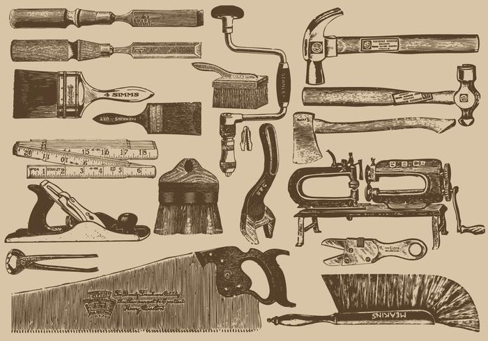

How to manipulate cases with dplyr in R (part 2)
================
Martin Frigaard
2017-08-30

<!-- -->

This tutorial is part 2 of manipulating data with `dplyr` and friends in
the `tidyverse`.

For newcomers to R, check out the [Data Journalism in
R](http://bit.ly/2MGFh2f) on Storybench.

# Motivation

Often you’ll be interested in data that meet specific criteria, and not
an entire data set. `dplyr` comes with a set of functions (verbs) for
reducing a data set to only those cases that meet conditions you define.
I will demonstrate these functions with the data set from last
tutorial.These data are from a survey created by FiveThirtyEight for the
article titled,

[“What Do Men Think It Means To Be A Man?”.](https://53eig.ht/2FYCOQk)

Find these data in their raw form on the [GitHub
repository](http://bit.ly/2RUUanr). We will load data from the last
tutorial in the code chunk below:

## Importing data

``` r
MascSurveyData <- readr::read_csv("data/2019-01-30-MascSurveyData.csv")
```

    ## Parsed with column specification:
    ## cols(
    ##   .default = col_character(),
    ##   id = col_double(),
    ##   start_date = col_datetime(format = ""),
    ##   end_date = col_datetime(format = ""),
    ##   weight = col_double(),
    ##   masc_ind = col_logical()
    ## )

    ## See spec(...) for full column specifications.

Important things to note about the import:

1.  the default column is `col_character()`, so most variables will be
    character strings
2.  `id` and `weight` are numeric (`col_double()`)
3.  both dates are formatted as date-time (`col_datetime(format = "")`)
4.  the masculine indicator (`masc_ind`) is a binary (`TRUE` / `FALSE`)
    variable

## Filtering responses

The `dplyr::filter()` function works by including only rows that meet a
condition in a logical statement (i.e. the condition is TRUE for that
case). For example, if I wanted to only include respondents who describe
their sexual orientation as `"Straight"` (question 26), I would use the
following:

``` r
MascSurveyData %>% 
    dplyr::filter(q0026 == "Straight")
```

``` r
# # A tibble: 1,408 x 100
#       id start_date          end_date            how_masc how_important
#    <dbl> <dttm>              <dttm>              <chr>    <chr>        
#  1     2 2018-05-10 06:30:00 2018-05-10 06:53:00 Somewha… Somewhat imp…
#  2     3 2018-05-10 07:02:00 2018-05-10 07:09:00 Very ma… Not too impo…
#  3     5 2018-05-10 07:35:00 2018-05-10 07:42:00 Very ma… Very importa…
#  4     6 2018-05-10 08:25:00 2018-05-10 08:34:00 Very ma… Somewhat imp…
#  5     8 2018-05-10 10:04:00 2018-05-10 10:11:00 Somewha… Somewhat imp…
#  6     9 2018-05-10 11:00:00 2018-05-10 11:07:00 Very ma… Not at all i…
#  7    10 2018-05-11 12:36:00 2018-05-11 12:43:00 Somewha… Somewhat imp…
#  8    11 2018-05-11 03:07:00 2018-05-11 03:16:00 Very ma… Somewhat imp…
#  9    12 2018-05-11 05:18:00 2018-05-11 05:33:00 Somewha… Not too impo…
# 10    13 2018-05-11 05:50:00 2018-05-11 05:53:00 Very ma… Somewhat imp…
# # … with 1,398 more rows, and 95 more variables:
```

This returns a data frame with fewer rows than the original (1,408
vs. 1,615) because this only includes the `"Straight"` respondents.

##
